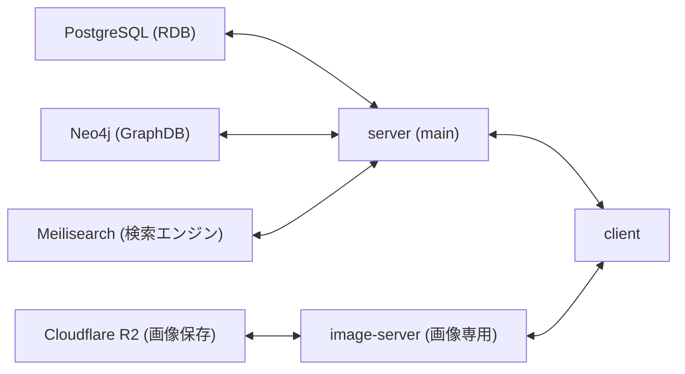

# 概略図

```mermaid
flowchart LR
    rdb["PostgreSQL (RDB)"] <--> server["server (main)"]
    graphdb["Neo4j (GraphDB)"] <--> server["server (main)"]
    meilisearch["Meilisearch (検索エンジン)"] <--> server["server (main)"]
    cloudflare["Cloudflare R2 (画像保存)"] <--> image-server["image-server (画像専用)"]
    server["server (main)"] <--> client["client"]
    image-server["image-server (画像専用)"] <--> client["client"]
```
