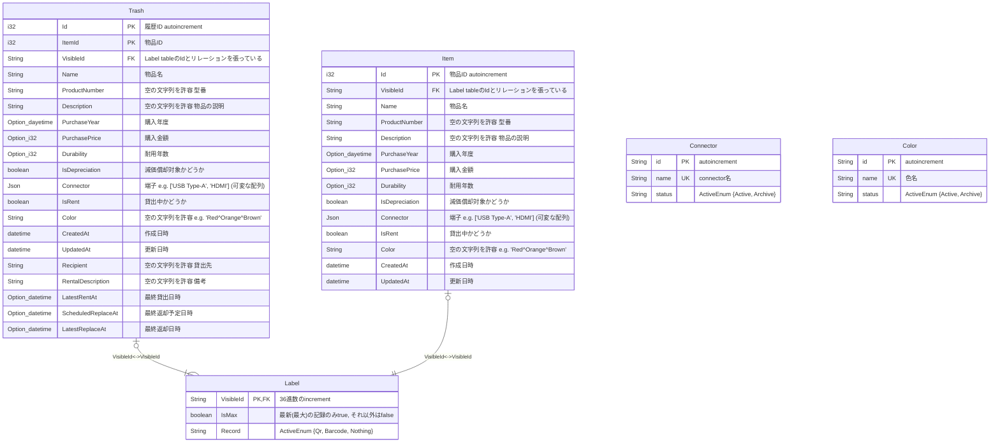
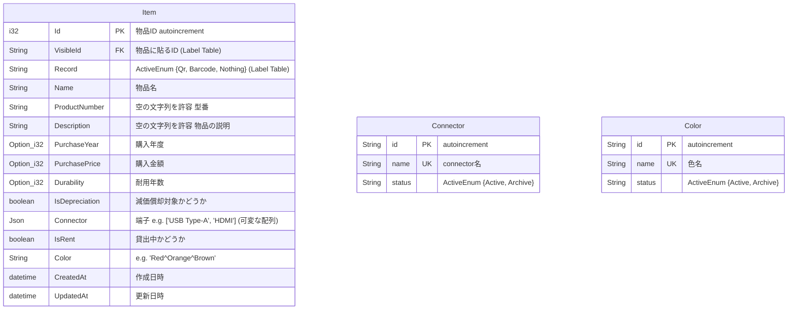

# RDB (PostgreSQL)

Table 同士の親と子の関係は以下の通り

| 親          | 子         |
| ----------- | ---------- |
| Lable Table | Item Table |



# GraphDB (Neo4j)

一つの木構造を持っている。


# Meiliserach

`Visible Id`と`Record`だけ、Label Table にある



# FrontEndで保有しているData

## 端子の種類

```typescript
type ConnectorType = "USB Type-A" | "USB Type-C";
```

## ケーブルに巻く色のパターン

色は、Camel Caseの英語名

```typescript
type Color = Red | Green;
```
