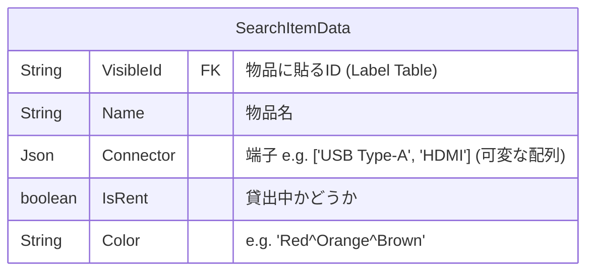
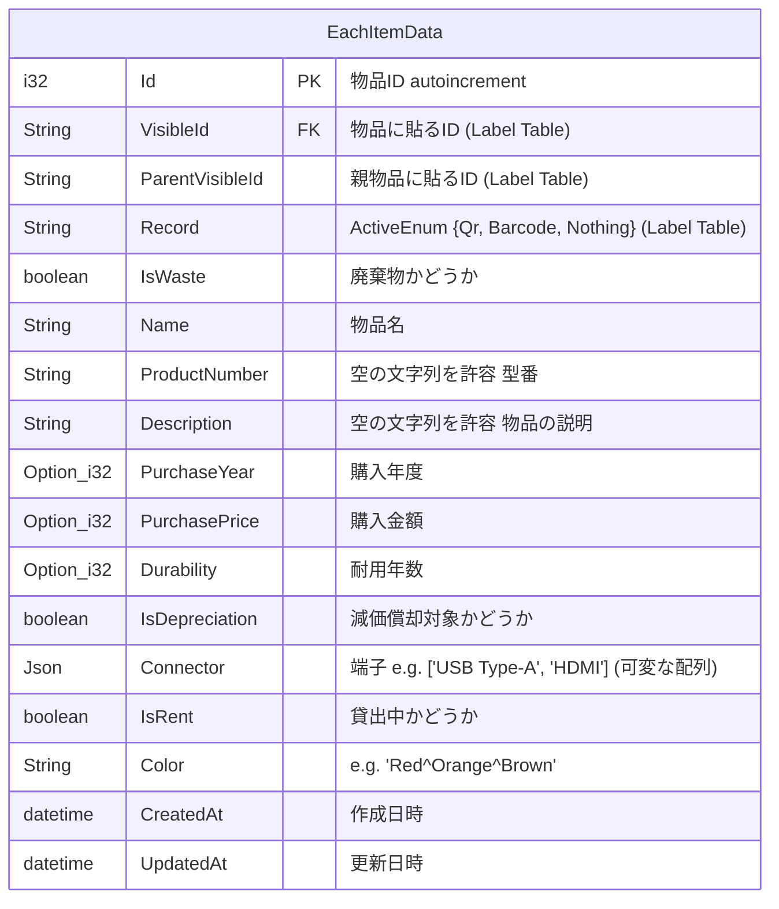
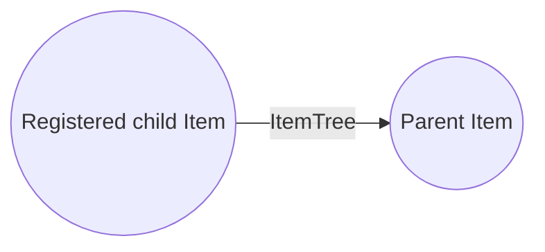
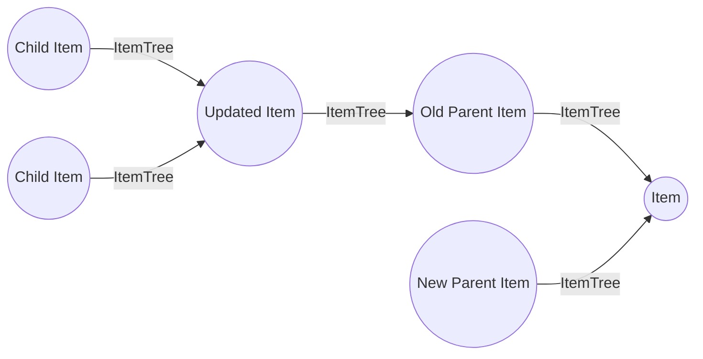
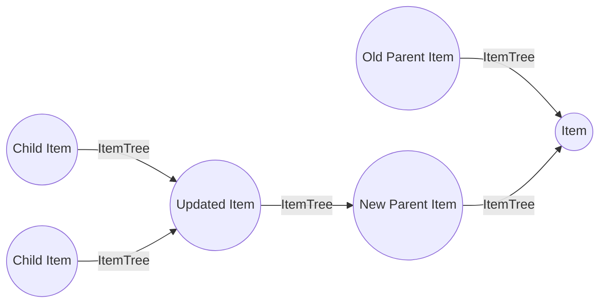
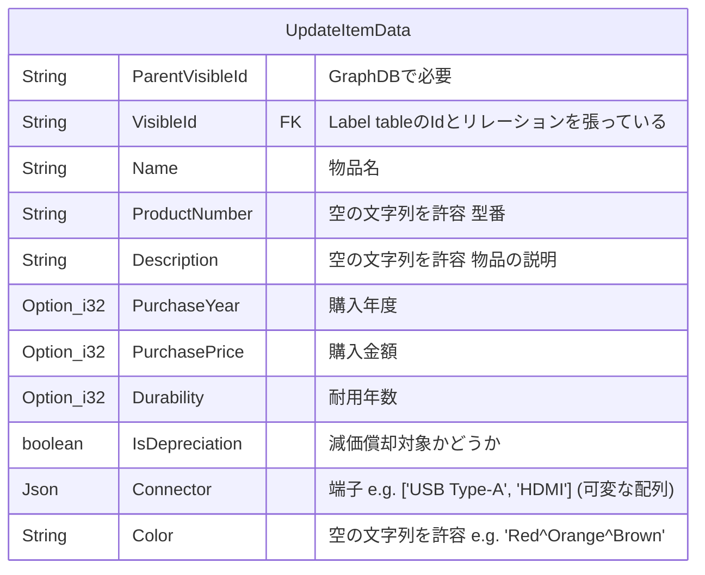
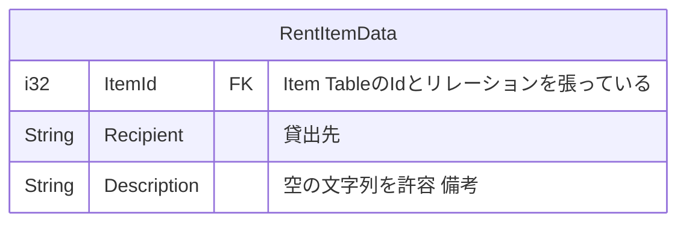
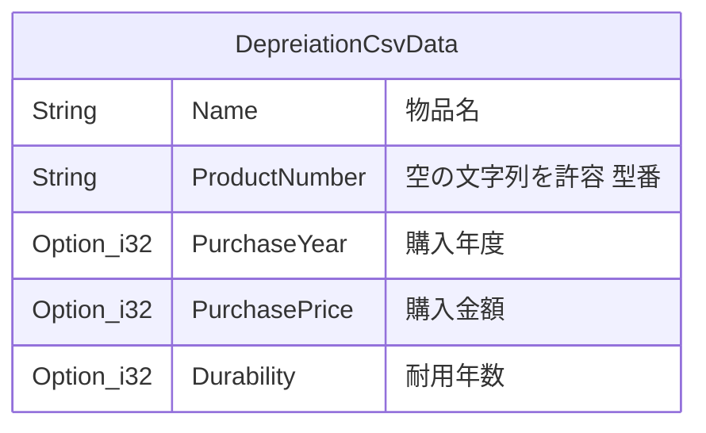
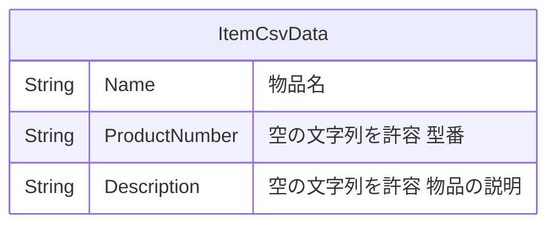

# /login (GET)

Auth0 の認証 (一旦、basic 認証)

## 外部接続

- Auth0

## Request

```
header {}
body {}
```

## Response

```
header {Authorization}
body {}
```

# /utils/healthcheck (GET)

RDB、GraphDB、Meilisearch のコンテナが稼動しているかのチェック

## 外部接続

- RDB
- GraphDB
- Meilisearch

## 処理RegisterItemData

1. RDB の healthcheck
2. GraphDB の healthcheck
3. Meilisearch の healthcheckRegisterItemData
4. 200を返す (200)

## Request

```
header {}
body {}
```

## Response

```
header {}
body {}
```

# /Item/search?keywords={keyword} (GET)

keyword に引っかかる検索結果を取得

## 外部接続

- Meilisearch

## 処理

1. Meilisearch の healthcheck
2. `keyword`を検索 (Meilisearch)

※ 複数`keyword`の場合は、`+`で結合されて来るのでスペースに変換して Meilisearch に突っこむ
参考サイト: https://www.meilisearch.com/docs/learn/filtering_and_sorting/filter_search_results

3. SearchItemData 型の配列 を返す (200)

## Request

```
header {Authorization}
body {}
```

## Response Type



## Response

```
header {Authorization}
body {
  SearchItemData[]
}
```

# /item/{VisibleId} (GET)

ItemId で指定した物品の情報を取得 (一つだけのはず)

## 外部接続

- RDB
- GraphDB

## 処理

1. RDB の healthcheck
2. GraphDBのhealthcheck
3. `VisibleId`から Item Table を検索 (RDB) <- このとき、`IsWaste`が`false`であることが条件
4. 2.が成功したら、`VisibleId`から Label Table を検索 (RDB)
5. `Id`(Item Table)で親物品を検索 (GraphDB) <- 親物品の`Id`を取得
6. `Id` (Item Table)から親物品の`VisibleId`を取得
7. EachItemData 型 を返す (200)

## Request

```
header {Authorization}
body {}
```

## Response Type



## Response

```
header {Authorization}
body {
  MeilisearchItemData
}
```

# /item/connector/{ConnecrtorName} (GET)

コネクタで絞り込み検索された対象の全物品の情報を返す

## 外部接続

- Meilisearch

## 処理

1. Meilisearch の healthcheck
2. filter で`Connector`を検索 (Meilisearch)

※ 検索前に文字列の両端に""をつける処理を書くこと
参考サイト: https://www.meilisearch.com/docs/learn/filtering_and_sorting/filter_search_results

3. SearchItemData 型の配列を返す (200)

## Request

```
header {Authorization}
body {}
```

## Response Type


## Response

```
header {Authorization}
body {
  MeilisearchItemData[]
}
```

# /item/cable (GET)

ケーブルの色で検索された物品を返す (一つだけのはず)

## 外部接続

- RDB

## 処理

1. RDB の healthcheck
2. `Color`をItem Tableで検索 (RDB) <- このとき`IsWaste`が`false`であることが条件

※ 検索前に色の単語同士を`^`で結合する処理を書くこと

3. SearchItemData 型 を返す (200)

## Request

```
header {Authorization}
body {
    {
        Color: string (e.g. 'Red^Orange^Brown')
    }
}
```

## Response Type


## Response

```
header {Authorization}
body {
    MeilisearchItemData[]
}
```

# /item/register (POST)

物品の登録をする

## 外部接続

- RDB
- GraphDB
- Meilisearch
- Cloudflrare R2

## 処理

1. RDB の healthcheck
2. GraphDB の healthcheck
3. MeiliSearch の healthcheck
4. validation の実行
   1. 登録される物品が新規の物品であるかをチェック (RDB, Meiliserach) <-RDBのチェックでは、`IsWaste`が`false`であることが条件
      1. RDBまたは、Meilisearchのどちらかにのみ登録データが残っていたら、エラーを返す <-重大なエラー
   2. 親物品が存在するかのチェック (RDB, GraphDB, Meilisearch) <- このとき`IsWaste`が`false`であることが条件
   3. VisibleId が Label Table に存在するかのチェック (RDB)
   4. 物品名が空でないかのチェック
5. VisileId で Label Table を検索 (RDB) <- 4-2.で拾う
6. Meilisearch に物品の登録する
7. RDB に物品の登録をする
   1. 登録に失敗したら、Meilisearch の情報を消して返す (500)
8. GraphDB に物品のノードを追加
   1. 登録に失敗したら、MEilisearch と RDB の情報を消して返す (500)
9. 200を返す (200)

## image-server の処理

1. Cloudflare R2 の healthcheck
2. 画像の upload
3. upload に失敗したら、500 を返す (500)
4. 200を返す (200)

## GraphDB での処理

登録した物品は、必ず葉になる



## RequestType


## Request

```
header {Authorization}
body {
  RegisterItemData
}
```

## Response

```
header {Authorization}
body {}
```

# /item/update (PUT)

物品情報の更新をする

## 外部接続

- RDB
- GraphDB (Optional)
- Meilisearch
- Cloudflare R2 (Optional)

## 処理

1. RDB の healthcheck
2. GraphDB の healthcheck
3. Meilisearch の healthcheck
4. validation の実行

   1. VisibleId が Item Table に存在するかチェック (RDB) <- このとき`IsWaste`が`false`であることが条件
   2. 物品名が空でないかのチェック
   3. VisibleId が Label Table に存在するかのチェック (RDB)
   4. 親物品が存在するかのチェック (RDB, GraphDB, Meilisearch) <-この時、親物品が変わっているかどうかも見る。このとき`IsWaste`が`false`であることが条件
      1. 更新対象の物品が葉ではないとき
         1. 親物品が変わっている場合、親物品が更新対象の物品の子孫でないことをチェック
      1. 更新対象の物品が葉のとき
         1. skip

5. Meilisearch の登録情報の更新
   1. 更新対象の物品の変更が親物品のみの場合
      1. skip
   1. 更新対象の物品の変更が親物品以外もある場合
      1. Meilisearch の更新処理
6. RDB の登録情報の更新
   1. 更新対象の物品の変更が親物品のみの場合
      1. skip
   1. 更新対象の物品の変更が親物品以外もある場合
      1. Meilisearch の更新処理
7. GraphDB の登録情報の更新
   1. 更新対象の物品の変更が親物品のみの場合
      1. 親物品の変更処理
   1. 更新対象の物品の変更が親物品以外もある場合
      1. skip
8. 200を返す (200)

## GraphDB での処理

登録した物品は、必ず葉になる

最初の状態が以下のとき



更新処理後



## RequestType

RegisterItemDataと同様の型だが、拡張性の担保のため、別の型として扱う



## Request

```
header {Authorization}
body {
  UpdateItemData
}
```

## Response

```
header {Authorization}
body {}
```

# /item/delete/{VisibleId} (DELETE)

物品の削除をする

## 外部接続

- RDB
- GraphDB
- Meilisearch

※ 画像は永久に残すので、Cloudflare R2に接続しない

## 処理

1. RDBのhealthcheck
2. GraphDBのhealthcheck
3. Meilisearchのhealthcheck
4. `VisibleId`を検索 (RDB) <- このとき、`Id`を保持しておく (重要)。このとき`IsWaste`が`false`であることが条件
5. RDBのItem Tableから削除
6. `VisibleId`を検索 (Meilisearch)
7. Meilisearchから削除
8. `Id`を検索 (GraphDB)
9. GraphDBから削除
   1. 削除対象が葉の場合
      1. 削除対象のノードを削除
   1. 削除対象が葉でない場合
      1. 削除対象のノードの子要素を検索
      2. 削除対象のノードを削除 <-2と3は同時にしたい
      3. 削除対象のノードの子要素を削除対象のノードの親要素に結合
10. 200を返す (200)

## Request

```
header {Authorization}
body {}
```

## Response

```
header {Authorization}
body {}
```

# /rent/rent (POST)

物品の貸し出しをする

## 外部接続

- RDB

## 処理

1. RDBのhealthcheck
2. validationの実行
   1. 貸し出しの物品が存在するかチェック <-このとき、Item Tableを検索するが、`IsWaste`が`false`が条件
3. `ItemId` (Item TableのId)を検索して、Item TableのIdを取得
4. Rent Tableに貸し出し履歴を追加
5. Item Tableの`IsRent`をTrueにする
6. 200を返す (200)

## RequestType



## Request

```
header {Authorization}
body {
    RentItemData
}
```

## Response

```
header {Authorization}
body {}
```

# /rent/return/{ItemId} (PUT)

物品の返却をする

## 外部接続

- RDB

## 処理

1. RDBのhealthcheck
2. validationの実行
   1. `VisibleId`をItem Tableで検索 <- ここで、`Id`を取得。このとき、`IsWaste`が`false`が条件
      1. `IsRent`が`false`なら、500で返す
   2. `ItemId`(1.で取得した`Id`)をRent Tableで検索
3. Item Tableの`IsRent`を`false`に変える
4. Rent Tableの`UpdatedAt`を更新
5. 200を返す

## Request

```
header {Authorization}
body {}
```

## Response

```
header {Authorization}
body {}
```

# /generate/qr (POST)

## 外部接続

- RDB

Label Table に QR として使用する物品 ID を追加する

## 処理

1. RDBのhealthcheck
2. Label Tableに`Record`を`QR`指定し、n個生成
3. `Id`(Label Table)の配列を返す

## Request

```
header {Authorization}
body {}
```

## Response

```
header {Authorization}
body {
  Label TableのId[]
}
```

# /generate/barcode (POST)

Label Table に barcode として使用する物品 ID を追加する

## 外部接続

- RDB

## 処理

1. RDBのhealthcheck
2. Label Tableに`Record`を`Barcode`に指定し、n個生成
3. `Id`(Label Table)の配列を返す

## Request

```
header {Authorization}
body {}
```

## Response

```
header {Authorization}
body {
  Label TableのId[]
}
```

# /csv/depreiation (GET)

減価償却の csv データを返す。

## 外部接続

- RDB

## 処理

1. RDBのhealthcheck
2. Item Tableの`IsDepreciation`の物品を検索 <-このとき、`IsWaste`が`false`であることが条件
3. `DepreiationCsvData`の配列を返す

## Request

```
header {Authorization}
body {}
```

## ResponseType



## Response

```
header {Authorization}
body {
   DepreiationCsvData[]
}
```

# /csv/item (GET)

物品リストの csv データを返す。

## 外部接続

- RDB

## 処理

1. RDBのhealthcheck
2. Item Tableの`IsWaste`が`false`の物品を検索
3. `ItemCsvData`の配列を返す

## Request

```
header {Authorization}
body {}
```

## ResponseType

ItemCsvDataをしばく



## Response

```
header {Authorization}
body {
    ItemCsvData[]
}
```
