# /api/login (GET)

Auth0 の認証 (一旦、basic 認証)

## 外部接続

- Auth0

## Request

```
header {}
body {}
```

## Response

```
header {Authorization}
body {}
```

# /api/healthcheck (GET)

RDB、GraphDB、Meilisearch のコンテナが稼動しているかのチェック

## 外部接続

- RDB
- GraphDB
- Meilisearch

## 処理RegisterItemData

1. healthcheck
2. Meilisearch の healthcheckRegisterItemData
3. 200を返す (200)

## Request

```
header {}
body {}
```

## Response

```
header {}
body {}
```

# /api/item/search?keywords={keywords} (GET)

keyword に引っかかる検索結果を取得

## 外部接続

- Meilisearch

## 処理

1. healthcheck
2. `keywords`を検索 (Meilisearch)

※ 複数`keywords`の場合は、`+`で結合されて来るのでスペースに変換して Meilisearch に突っこむ

3. SearchItemData 型の配列 を返す (200)

## Request

```
header {Authorization}
body {}
```

## Response Type

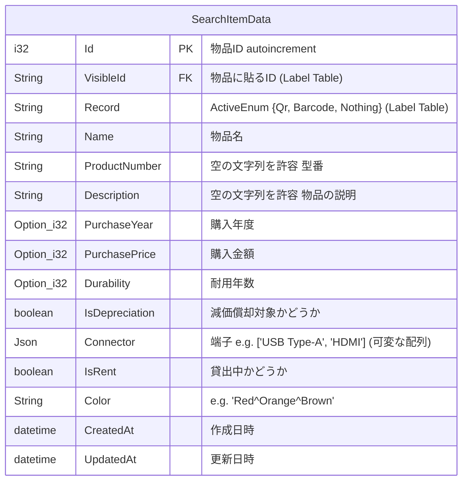

## Response

```
header {Authorization}
body {
  search_items: SearchItemData[]
}
```

# /api/item/{Id} (GET)

ItemId で指定した物品の情報を取得 (一つだけのはず)

## 外部接続

- RDB
- GraphDB

## 処理

1. healthcheck
2. `Id`から Item Table を検索 (RDB)
3. 2.が成功したら、`Id`から Label Table を検索 (RDB)
4. `Id`(Item Table)で親物品を検索 (GraphDB) <- 親物品の`Id`を取得
5. `Id` (Item Table)から親物品の`Id`を取得
6. EachItemData 型 を返す (200)

## Request

```
header {Authorization}
body {}
```

## Response Type

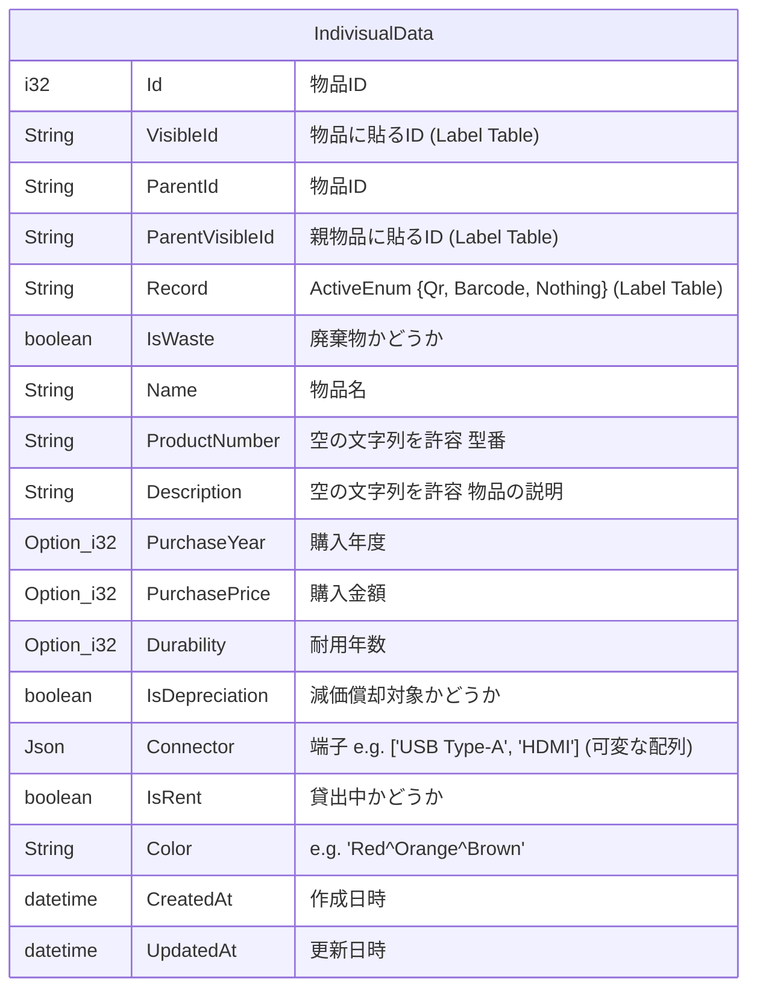

## Response

```
header {Authorization}
body {
  MeilisearchItemData
}
```

# /api/item/trash (GET)

削除履歴を返す

## 外部接続

- RDB

## 処理

1. healthcheck
2. 全取得する
3. TrashItemData 型 の配列を返す (200)

## Request

```
header {Authorization}
body {}
```


## Response Type

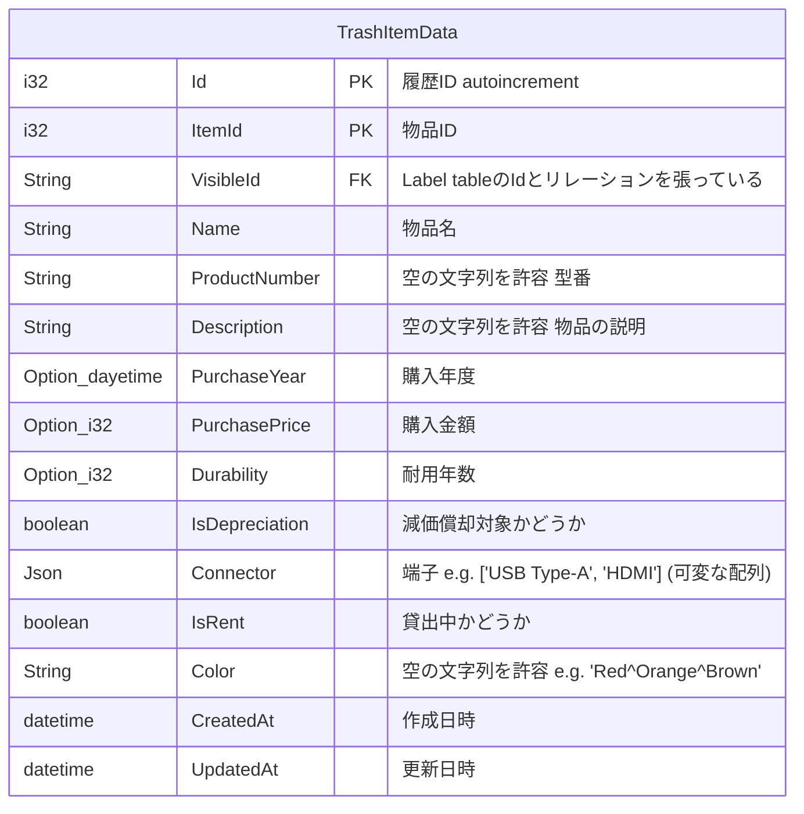

## Response

```
header {Authorization}
body {
    TrashItemData[]
}
```

# /api/item/register (POST)

物品の登録をする

## 外部接続

- RDB
- GraphDB
- Meilisearch
- Cloudflrare R2

## 処理

1. healthcheck
2. validation の実行
   1. 物品名が空でないかのチェック (Json)
   2. VisibleId が Label Table に存在するかのチェック (RDB)
   3. 登録される物品が新規の物品であるかをチェック (RDB, Meiliserach) <- VisibleIdの被りがないかのチェックをする Item Tableを検索
      1. RDBまたは、Meilisearchのどちらかにのみ登録データが存在したら、エラーを返す <-重大なエラー
   4. 親物品が存在するかのチェック (RDB, GraphDB, Meilisearch)
   5. Colorが空ではない場合は、被りがないかチェック (RDB, Meiliserach)
3. VisileId で Label Table を検索 (RDB) <- 2.1. で完了している

(ここでQr or Barcodeの情報を拾う)

5. RDB に物品の登録をする

- Recipient: ""
- RentalDescription: ""
- LatestRentAt: None
- ScheduledReplaceAt: None
- LatestReplaceAt: None

4. Meilisearch に物品の登録する
   1. 登録に失敗したら、RDB の情報を消して返す (500)
6. GraphDB に物品のノードを追加
   1. 登録に失敗したら、Meilisearch と RDB の情報を消して返す (500)
7. 200を返す (200)

## image-server の処理

1. Cloudflare R2 の healthcheck
2. 画像の upload
3. upload に失敗したら、500 を返す (500)
4. 200を返す (200)

## GraphDB での処理

登録した物品は、必ず葉になる

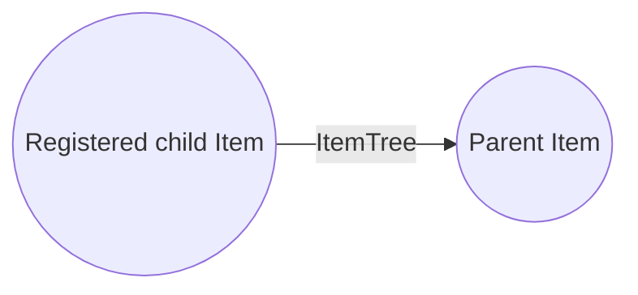

## RequestType

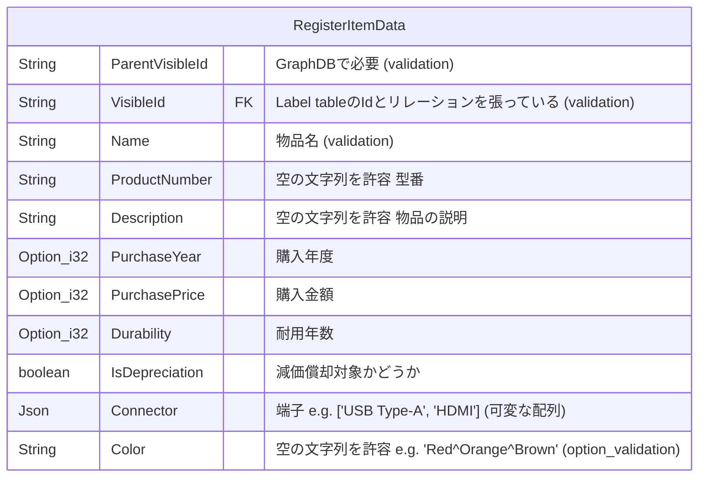

## Request

```
header {Authorization}
body {
  RegisterItemData
}
```

## Response

```
header {Authorization}
body {}
```

# /api/item/update/{Id} (PUT)

物品情報の更新をする

## 外部接続

- RDB
- Meilisearch
- Cloudflare R2 (Optional)

## 処理

1. healthcheck
2. 根の物品の削除のブロック
3. validation の実行
   1. 物品名が空でないかのチェック (Json)
   2. Id が Item Table に存在するかチェック (RDB)
   3. VisibleId が Label Table に存在するかのチェック (RDB)
   4. Colorが空ではない場合は、被りがないかチェック (RDB, Meiliserach)
4. RDB の登録情報の更新
5. Meilisearch の登録情報の更新
6. 200を返す (200)

## RequestType

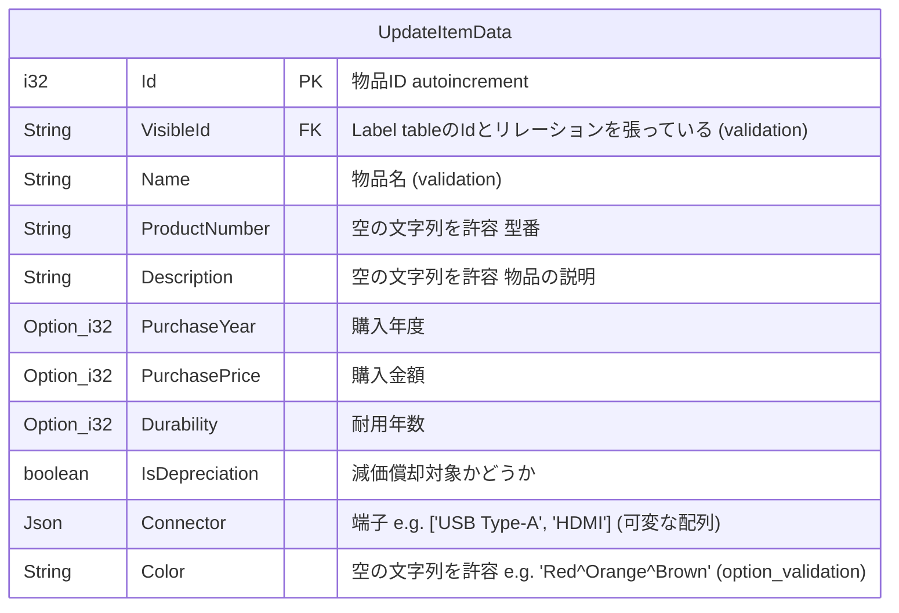

## Request

```
header {Authorization}
body {
  UpdateItemData
}
```

## Response

```
header {Authorization}
body {}
```

# /api/item/delete/{Id} (DELETE)

物品の削除をする

## 外部接続

- RDB
- GraphDB
- Meilisearch

※ 画像は永久に残すので、Cloudflare R2に接続しない

## 処理

1. healthcheck
2. 根の物品の削除のブロック
3. `Id`を検索し、対象の物品が存在することをチェック (RDB, Meilisearch) <- このとき、`Item Table` (RDB) 及び`Item` (Meilisearch) を保持しておく。
    1. `Id`が1の場合は、除外する
    2. RDBまたは、Meilisearchのどちらかにのみ登録データが存在したら、エラーを返す <-重大なエラー
4. GraphDBから削除できるかのチェック
    1. 削除対象が葉でない場合
        1. エラーを吐く (400 or 500)
5. `Id`を検索 (GraphDB)
6. 貸し出し中物品でないかチェック
    1. 貸し出し中だと削除できない (400)
7. Meilisearchを対象物品を削除
8. RDBのItem Tableの対象物品を削除
    1. 失敗したらMeilisearchを復元
9. GraphDBから削除
    1. 削除対象のノードを削除
        1. 失敗した場合
            1. 削除したRDBの情報を再登録することで、復元する <-この際、id情報を取得しておく。
                1. 失敗したら、critical insidentを返す (501)
            2. Meiliserachに新しいidの情報に更新した物品情報を再登録
                1. 失敗したら、critical insidentを返す (501)
            3. 500を返す
10. 200を返す (200)

## Request

```
header {Authorization}
body {}
```

## Response

```
header {Authorization}
body {}
```

# /api/item/transfer (PATCH)

物品の移動をする

## 外部接続

- RDB
- GraphDB

## 処理

1. healthcheck
2. `Id`の物品が存在するかのチェック (RDB, GraphDB)
3. `NewParentVisibleId`の物品が存在するかのチェック (RDB, GraphDB) <- idを取得
4. 親物品が対象物品の子孫物品になっていないかのチェック (GraphDB)
8. 対象物品を移動
9. 200を返す (200)

## RequestType

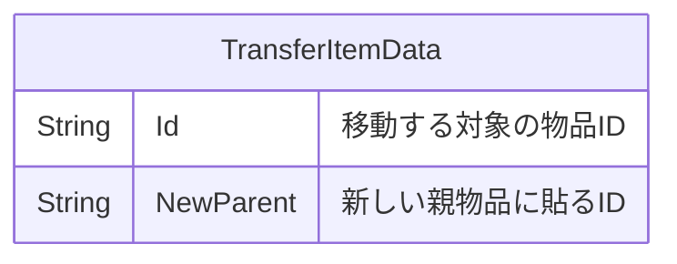

## Request

```
header {Authorization}
body {
    TransferItemData、
}
```

## Response

```
header {Authorization}
body {}
```

# /api/connector (POST)

接続端子の登録

## 外部接続

- RDB
- meilisearch

## 処理

1. healthcheck
2. cnnector名に被りがないかチェック
3. connector Tableに追加
4. Meilisearchに追加
5. 201を返す (201)

## RequestType

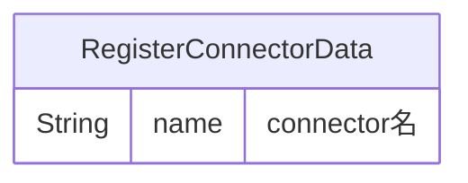

## Request

```
header {Authorization}
body {
    ConnectorData
}
```

## Response

```
header {Authorization}
body {}
```

# /api/connector/{id} (PATCH)

接続端子の`Status`を変更する

## 外部接続

- RDB
- meilisearch

## 処理

1. healthcheck
2. connector Table の `status`を更新する
3. Meilisearch の `status`を更新する
4. 200を返す (200)

## RequestType

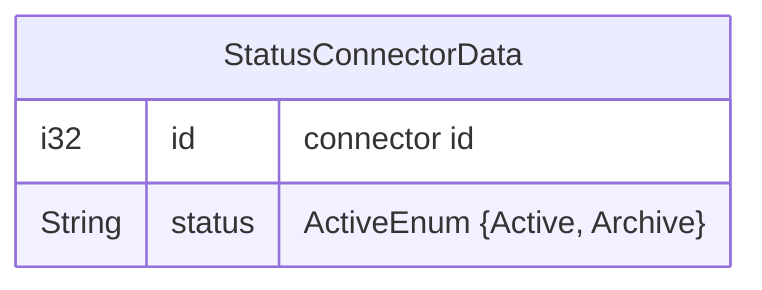

## Request

```
header {Authorization}
body {}
```

## Response

```
header {Authorization}
body {}
```

# /api/connector (GET)

全接続端子を取得

## 外部接続

- RDB

## 処理

1. healthcheck
6. ConnectorDataの配列を返す (200)

## Request

```空の文字列を許容 
header {Authorization}
body {}
```

## ResponseType

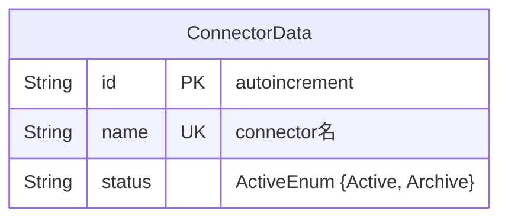

## Response

```
header {Authorization}
body {
    ConnectorData[]
}
```

# /api/connector/search?keywords={keywords} (GET)

接続端子を検索

## 外部接続

- meilisearch

## 処理

1. healthcheck
2. `keywords`を検索 (Meilisearch)

※ 複数`keywords`の場合は、`+`で結合されて来るのでスペースに変換して Meilisearch に突っこむ

3. ConnectorDataの配列を返す (200)

## Request

```
header {Authorization}
body {}
```

## ResponseType


## Response

```
header {Authorization}
body {
    ConnectorData[]
}
```

# /api/rental/rent/{Id} (POST)

物品の貸し出しをする

## 外部接続

- RDB
- meilisearch

## 処理

1. healthcheck
2. validationの実行
   1. `Recipient`が空でないことをチェック (Json)
      1. `Recipient`が`なら、400で返す
   2. 貸し出しの物品が存在するかチェック (RDB, MeiliSearch)
      1. なければ400で返す
   3. `IsRent`が`false`であるかチェック (RDB, MeiliSearch)
      1. `IsRent`が`true`なら、500で返す
4. Meilisearchの`IsRent`を`true`にする
5. Item Tableの`IsRent`を`true`にする
6. `RentItemData`をItem tableに突っこむ
7. `LatestRentAt`を更新
8. `LatestReplaceAt`を`None`に更新 
9. 200を返す (200)

## RequestType

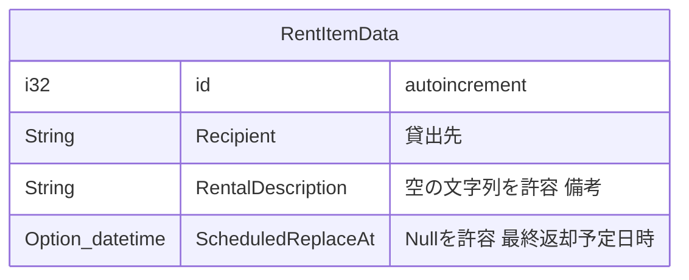

## Request

```
header {Authorization}
body {
    RentItemData
}
```

## Response

```
header {Authorization}
body {}
```

# /api/rental/update/{Id} (PUT)

物品の貸し出し情報の更新をする

## 外部接続

- RDB

## 処理

1. healthcheck
2. validationの実行
   1. 貸し出しの物品が存在するかチェック
      1. なければ400で返す
   2. `IsRent`が`true`であるかチェック
      1. `IsRent`が`false`なら、500で返す
3. `ItemId` (Item TableのId)を検索して、Item TableのIdを取得
5. `RentItemData`をItem tableに突っこむ
8. 200を返す (200)

## RequestType

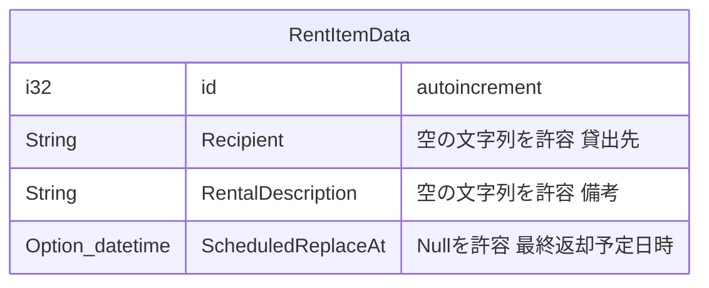

## Request

```
header {Authorization}
body {
    RentItemData
}
```

## Response

```
header {Authorization}
body {}
```

# /api/rental/replace/{Id} (PATCH)

物品の返却をする

## 外部接続

- RDB
- MeiliSearch

## 処理

1. healthcheck
2. validationの実行
   1. `Id`をItem Tableで検索 (RDB)
      1. `IsRent`が`false`なら、500で返す
3. ItemTableの`IsRent`を`false`に更新 (RDB)
4. Meilisearchの`IsRent`を`true`にする
5. `Recipient`を空の文字列にする
6. `RentalDescription`を空の文字列にする
7. `ScheduledReplaceAt`を空の文字列にする
8. `LatestReplaceAt`に現在の時刻を突っこむ
9. 200を返す

## Request

```
header {Authorization}
body {}
```

## Response

```
header {Authorization}
body {}
```

# /api/generate (POST)

## 外部接続

- RDB

Label Table に QR として使用する物品 ID を追加する

## 処理

1. healthcheck
2. Label Tableに`Record`を指定し、n個生成
3. `VisibleId`(Label Table)の配列を返す

## RequestType

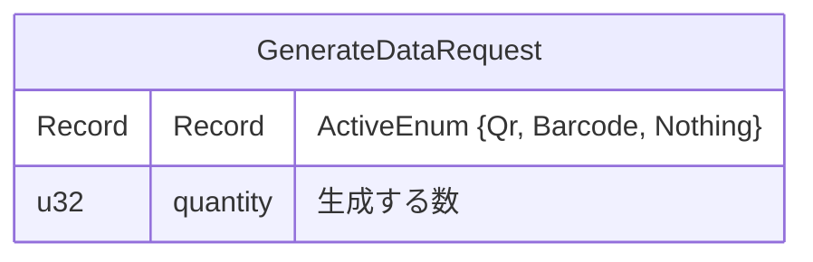

## Request

```
header {Authorization}
body {
    GenerateDataRequest,
}
```

## ResponseType

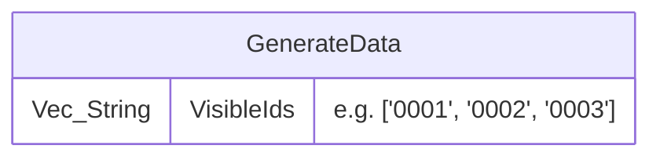

## Request

```
header {Authorization}
body {
    GenerateData,
}
```

# /api/csv/depreiation (GET)

減価償却の csv データを返す。

## 外部接続

- RDB

## 処理

1. healthcheck
2. Item Tableの`IsDepreciation`の物品を検索
3. `DepreiationCsvData`の配列を返す

## Request

```
header {Authorization}
body {}
```

## ResponseType

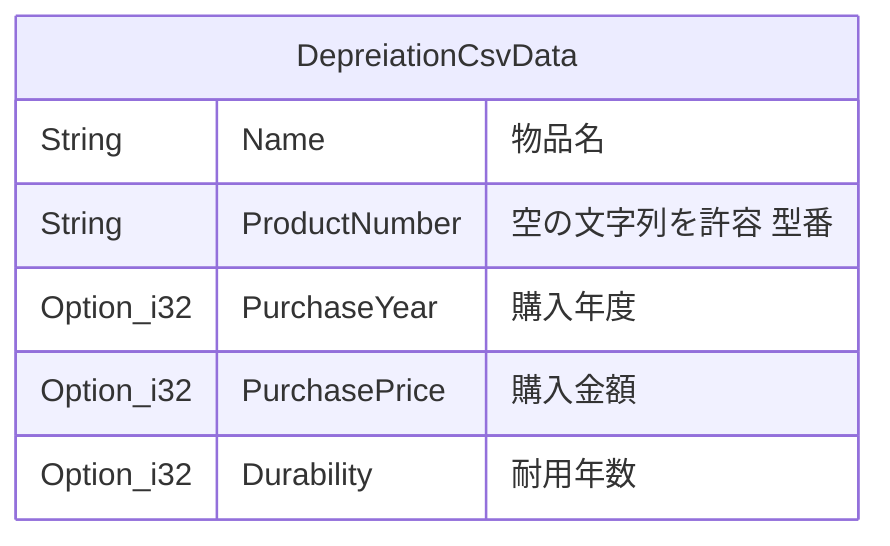

## Response

```
header {Authorization}
body {
   depreciation_items: DepreiationCsvData[]
}
```

# /api/csv/item (GET)

物品リストの csv データを返す。

## 外部接続

- RDB

## 処理

1. healthcheck
2. Item Tableを全取得
3. `ItemCsvData`の配列を返す

## Request

```
header {Authorization}
body {}
```

## ResponseType

ItemCsvDataをしばく

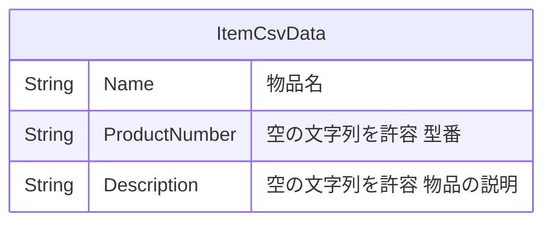

## Response

```
header {Authorization}
body {
    items: ItemCsvData[]
}
```
