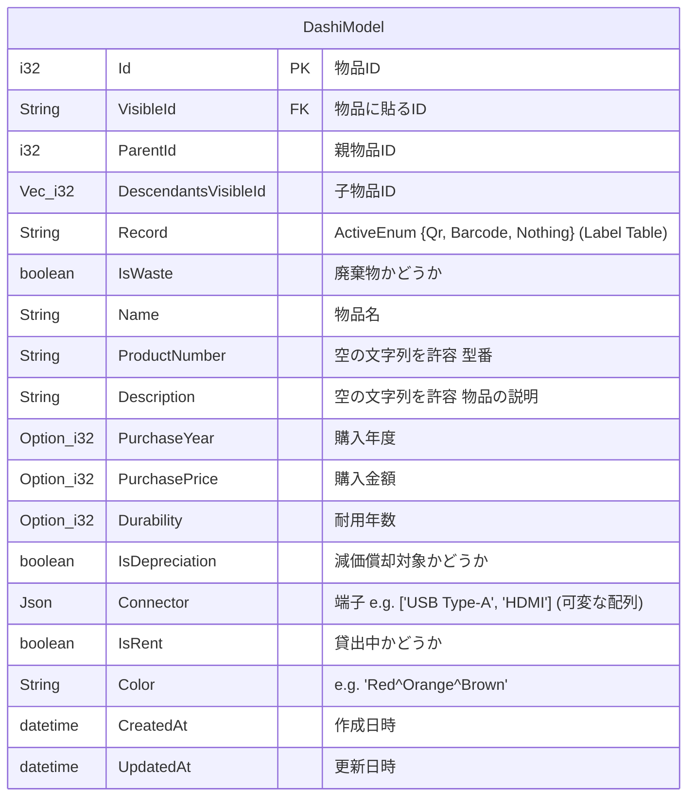

# severで扱う汎用的なデータ型

```mermaid
erDiagram
    DashiModel {
        i32 Id PK "物品ID"
        String VisibleId FK "物品に貼るID"
        i32 ParentId "親物品ID "
        Vec_i32 DescendantsVisibleId "子物品ID"
        String Record "ActiveEnum {Qr, Barcode, Nothing} (Label Table)"
        boolean IsWaste "廃棄物かどうか"
        String Name "物品名"
        String ProductNumber "空の文字列を許容 型番"
        String Description "空の文字列を許容 物品の説明"
        Option_i32 PurchaseYear "購入年度"
        Option_i32 PurchasePrice "購入金額"
        Option_i32 Durability "耐用年数"
        boolean IsDepreciation "減価償却対象かどうか"
        Json Connector "端子 e.g. ['USB Type-A', 'HDMI'] (可変な配列)"
        boolean IsRent "貸出中かどうか"
        String Color "e.g. 'Red^Orange^Brown'"
        datetime CreatedAt "作成日時"
        datetime UpdatedAt "更新日時"
    }
```
