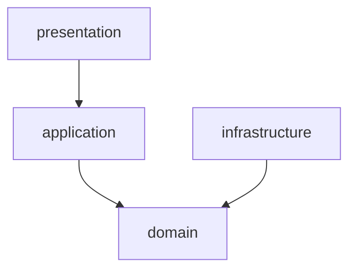

# 構造

server では、Layered Architecture を採用している

※ SeaORM を採用している関係で構造が乱れているが、 SeaORM を使用する場合はこの構造のままの方が使いやすいので、この構造のままにしている

## presentation

- dashi-server の main の binary crate

## application

- src/application 以下の library crate

## domain

- src/domain 以下の library crate
- entity

## infrastructure

- src/infrastructure 以下の library crate
- migration
- entity
